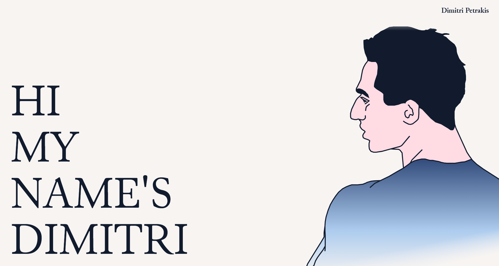

# Dimitri Petrakis - Portfolio v2

A modern, interactive portfolio website built with React and Tailwind CSS, featuring innovative draggable project cards and a comprehensive design system.

## 🚀 Live Demo

[View Live Portfolio](https://dimitripetrakis.com)

## 📋 Design Document

The complete design process, wireframes, and visual system are documented in the embedded design document below:



**[📄 View Full Design Document (PDF)](./design_document.pdf)**

*This comprehensive design document includes:*
- User research and personas
- Wireframes and mockups  
- Color palette and typography system
- Component library and design tokens
- Responsive design considerations
- Accessibility guidelines

## ✨ Features

### Interactive Project Display
- **Draggable Cards**: Intuitive drag-and-drop interface for desktop users
- **Responsive List View**: Mobile-optimized scrollable project timeline
- **Smart View Toggle**: Automatic mobile detection with manual override on desktop
- **Interactive Hover States**: Rich information overlay on card hover

### Modern UI/UX
- **Custom Typography**: Curated font stack (Junicode, Satoshi, Sentient)
- **Smooth Animations**: Fade-in effects and scroll-based interactions
- **Responsive Design**: Optimized for all screen sizes
- **Dark/Light Theming**: Consistent color system with CSS variables

### Performance Optimized
- **Lazy Loading**: Images load as needed for better performance
- **Font Display Optimization**: `font-display: swap` for faster text rendering
- **Asset Preloading**: Critical resources loaded efficiently
- **Optimized Animations**: Hardware-accelerated transforms

### Content Management
- **Dynamic Project Cards**: Easy to update project data
- **Contact and Newsletter Form**: EmailJS integration for direct messaging
- **Social Media Integration**: Direct links to all platforms

## 🛠️ Tech Stack

- **Frontend**: React JS, Vite
- **Styling**: Tailwind CSS, Custom CSS
- **Email**: EmailJS for form handling

## 🎨 Design System

### Color Palette
```css
--color-primary-blue: #ADCCEE    /* Primary */
--color-primary-pink: #FFDBE4    /* Primary */
--color-secondary-blue: #385893  /* Secondary */
--color-light: #F7F4F2           /* Background */
--color-dark: #111B2D            /* Text */
```

### Typography
- **Headlines**: Junicode (Serif)
- **UI Elements**: Satoshi (Sans-serif)  
- **Body Text**: Sentient (Serif)


### Thank you for viewing my project!
*Built with ❤️ by Dimitri Petrakis*
